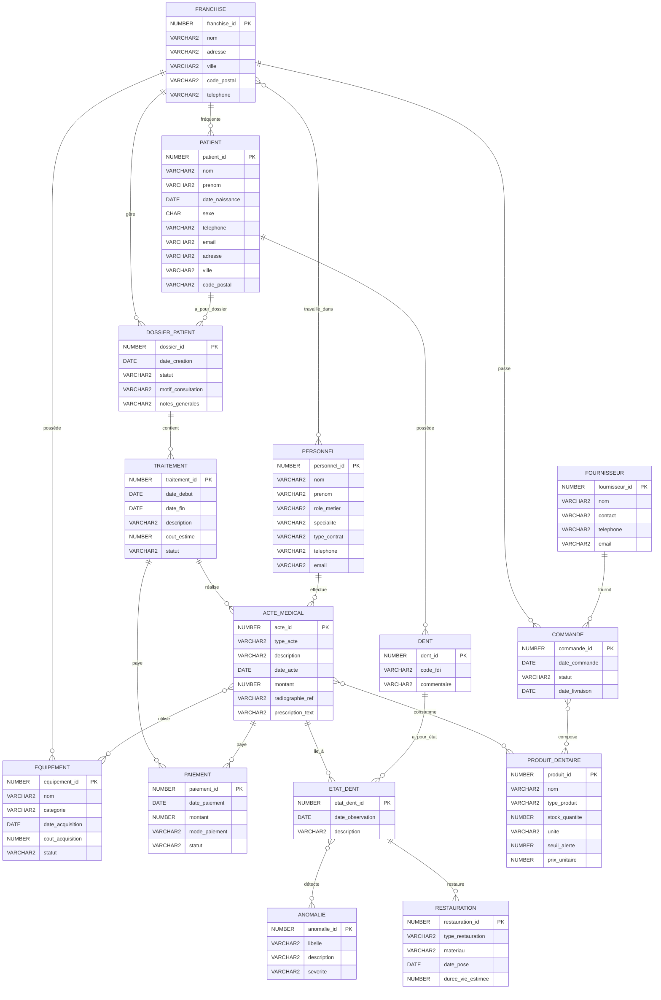
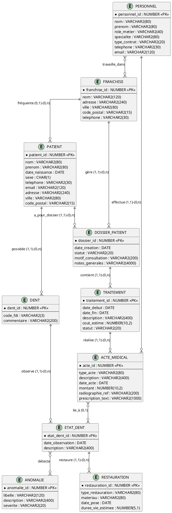

# Diagramme du Modèle Conceptuel de Données (MCD)

## 🎨 Comment visualiser le MCD

### Option 1 : Utiliser Mermaid (recommandé pour GitHub)
Le diagramme Mermaid ci-dessous s'affiche automatiquement sur GitHub.

### Option 2 : Utiliser Draw.io
1. Allez sur https://app.diagrams.net/
2. Importez le fichier `MCD_drawio.xml` (ci-dessous)
3. Éditez et exportez en PNG/PDF

### Option 3 : Utiliser Looping (logiciel français spécialisé MCD)
1. Téléchargez Looping : http://www.looping-mcd.fr/
2. Créez le MCD avec l'interface graphique
3. Générez automatiquement le MLD

### Option 4 : Utiliser ERDPlus
1. Allez sur https://erdplus.com/
2. Créez un nouveau diagramme ER
3. Utilisez les spécifications ci-dessous

---

## 📊 Diagramme MCD en Mermaid



---

## 📝 Légende des Cardinalités

| Notation Mermaid | Signification        | Description                    |
|------------------|----------------------|--------------------------------|
| `||--o{`         | 1 vers plusieurs (0,n)| Un à plusieurs (optionnel)    |
| `||--|{`         | 1 vers plusieurs (1,n)| Un à plusieurs (obligatoire)  |
| `}o--o{`         | Plusieurs à plusieurs| Relation N:M                   |
| `||--||`         | 1 vers 1             | Relation 1:1                   |

---

## 🎯 Cardinalités Détaillées

### Relations 1:N

| Association           | Entité Source | Card. | Entité Cible       | Card. |
|-----------------------|---------------|-------|--------------------|-------|
| FREQUENTER            | PATIENT       | 0,1   | FRANCHISE          | 0,n   |
| AVOIR_DOSSIER         | PATIENT       | 1,1   | DOSSIER_PATIENT    | 0,n   |
| OUVRIR_DANS           | DOSSIER_PATIENT| 0,n  | FRANCHISE          | 1,1   |
| CONTENIR              | DOSSIER_PATIENT| 1,1  | TRAITEMENT         | 0,n   |
| REALISER              | TRAITEMENT    | 1,1   | ACTE_MEDICAL       | 0,n   |
| EFFECTUER             | PERSONNEL     | 1,1   | ACTE_MEDICAL       | 0,n   |
| PAYER_ACTE            | ACTE_MEDICAL  | 0,1   | PAIEMENT           | 0,n   |
| PAYER_TRAITEMENT      | TRAITEMENT    | 0,1   | PAIEMENT           | 0,n   |
| FOURNIR               | FOURNISSEUR   | 1,1   | COMMANDE           | 0,n   |
| COMMANDER_POUR        | FRANCHISE     | 1,1   | COMMANDE           | 0,n   |
| POSSEDER_EQUIPEMENT   | FRANCHISE     | 0,1   | EQUIPEMENT         | 0,n   |
| APPARTENIR_A          | PATIENT       | 1,1   | DENT               | 0,n   |
| OBSERVER              | DENT          | 1,1   | ETAT_DENT          | 0,n   |
| LIER_A_ACTE           | ACTE_MEDICAL  | 0,1   | ETAT_DENT          | 0,n   |
| RESTAURER             | ETAT_DENT     | 1,1   | RESTAURATION       | 0,n   |

### Relations N:M

| Association           | Entité 1      | Card. | Entité 2           | Card. | Attributs             |
|-----------------------|---------------|-------|--------------------|-------|-----------------------|
| TRAVAILLER_DANS       | PERSONNEL     | 0,n   | FRANCHISE          | 0,n   | date_debut, date_fin  |
| COMPOSER              | COMMANDE      | 0,n   | PRODUIT_DENTAIRE   | 0,n   | quantite, prix_unitaire|
| DETECTER              | ETAT_DENT     | 0,n   | ANOMALIE           | 0,n   | -                     |
| CONSOMMER             | ACTE_MEDICAL  | 0,n   | PRODUIT_DENTAIRE   | 0,n   | quantite_utilisee     |
| UTILISER_EQUIPEMENT   | ACTE_MEDICAL  | 0,n   | EQUIPEMENT         | 0,n   | duree_minutes         |

---

## 📥 Fichier Draw.io (XML)

Créez un fichier `MCD_dentissimo.drawio` et collez ce contenu :

```xml
<?xml version="1.0" encoding="UTF-8"?>
<mxfile host="app.diagrams.net">
  <diagram name="MCD Clinique Dentissimo">
    <mxGraphModel dx="1422" dy="794" grid="1" gridSize="10" guides="1" tooltips="1" connect="1" arrows="1" fold="1" page="1" pageScale="1" pageWidth="827" pageHeight="1169">
      <root>
        <mxCell id="0" />
        <mxCell id="1" parent="0" />

        <!-- Instructions:
        1. Copiez ce XML
        2. Allez sur https://app.diagrams.net/
        3. Fichier > Importer > Depuis le texte
        4. Collez et importez
        5. Le diagramme de base sera créé, vous pouvez l'améliorer visuellement
        -->

        <mxCell id="note1" value="Pour créer le MCD complet dans Draw.io:&#xa;&#xa;1. Utilisez la palette 'Entity Relation'&#xa;2. Ajoutez les 15 entités (rectangles)&#xa;3. Ajoutez les 20 associations (losanges)&#xa;4. Reliez-les avec les cardinalités&#xa;5. Référez-vous au fichier MODELE_CONCEPTUEL.md"
                style="text;html=1;strokeColor=#d6b656;fillColor=#fff2cc;align=left;verticalAlign=top;whiteSpace=wrap;rounded=1;"
                vertex="1" parent="1">
          <mxGeometry x="40" y="40" width="400" height="160" as="geometry" />
        </mxCell>
      </root>
    </mxGraphModel>
  </diagram>
</mxfile>
```

---

## 🔧 Instructions pour Draw.io (Méthode Manuelle)

### Étape 1 : Créer les Entités (15 rectangles)

1. Allez sur https://app.diagrams.net/
2. Nouveau diagramme vierge
3. Utilisez la bibliothèque "Entity Relation" (à gauche)
4. Ajoutez 15 rectangles pour les entités :
   - FRANCHISE
   - PERSONNEL
   - PATIENT
   - DOSSIER_PATIENT
   - TRAITEMENT
   - ACTE_MEDICAL
   - PAIEMENT
   - PRODUIT_DENTAIRE
   - FOURNISSEUR
   - COMMANDE
   - EQUIPEMENT
   - DENT
   - ETAT_DENT
   - ANOMALIE
   - RESTAURATION

### Étape 2 : Ajouter les Associations (20 losanges)

Ajoutez 20 losanges pour les associations entre les entités (voir liste dans MODELE_CONCEPTUEL.md)

### Étape 3 : Relier avec les Cardinalités

Utilisez les connecteurs et ajoutez les cardinalités :
- `0,1` = optionnel, un seul
- `1,1` = obligatoire, un seul
- `0,n` = optionnel, plusieurs
- `1,n` = obligatoire, plusieurs

### Étape 4 : Ajouter les Attributs

Dans chaque rectangle d'entité, listez les attributs (soulignez la clé primaire).

---

## 🖥️ Alternative : Utiliser PlantUML

Créez un fichier `mcd.puml` :



Visualisez sur : https://www.plantuml.com/plantuml/uml/

---

## 🎓 Logiciel Recommandé : Looping

**Looping** est un logiciel français gratuit spécialisé dans les MCD/MLD :

1. **Télécharger** : http://www.looping-mcd.fr/
2. **Avantages** :
   - Interface spécialement conçue pour les MCD français
   - Génération automatique du MLD depuis le MCD
   - Export SQL direct
   - Gestion des cardinalités à la française (0,1 - 1,1 - 0,n - 1,n)
   - Génération de scripts SQL pour Oracle, MySQL, PostgreSQL

3. **Utilisation** :
   - Créez les entités avec leurs attributs
   - Créez les associations avec les cardinalités
   - Looping génère automatiquement le MLD
   - Exportez en SQL pour Oracle

---

## 📋 Checklist pour créer votre MCD visuel

- [ ] Choisir l'outil (Draw.io, Looping, ERDPlus)
- [ ] Créer les 15 entités rectangulaires
- [ ] Ajouter les attributs dans chaque entité
- [ ] Souligner les clés primaires
- [ ] Créer les 20 associations (losanges)
- [ ] Relier les entités aux associations
- [ ] Ajouter les cardinalités sur chaque liaison
- [ ] Ajouter les attributs des associations N:M
- [ ] Vérifier la cohérence avec MODELE_CONCEPTUEL.md
- [ ] Exporter en PNG/PDF pour le rapport

---

## 💡 Conseil

Pour votre projet BUT SD, je recommande **Looping** car :
- C'est l'outil utilisé en France pour l'enseignement des MCD
- Il respecte la notation française Merise
- Il génère automatiquement le MLD et le SQL
- C'est gratuit et facile à utiliser

Le diagramme Mermaid ci-dessus est parfait pour GitHub, mais pour votre rendu final, créez un vrai diagramme visuel avec Looping ou Draw.io !
